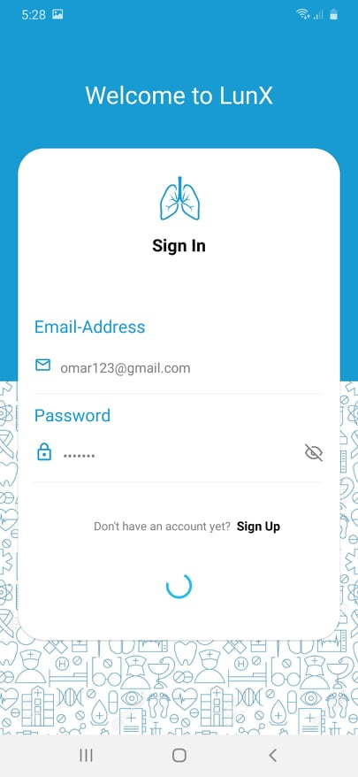
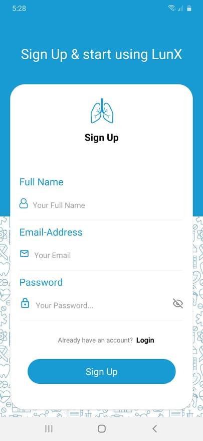
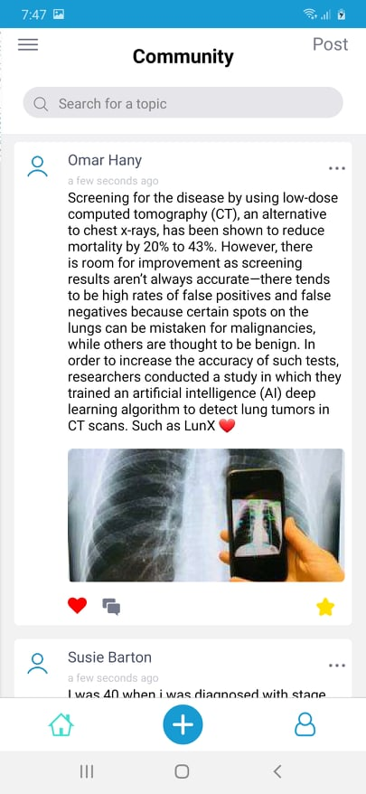
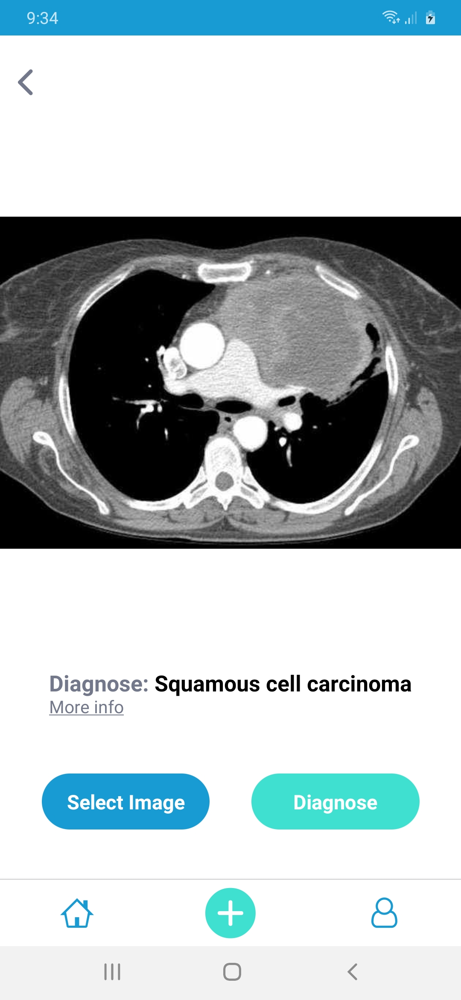
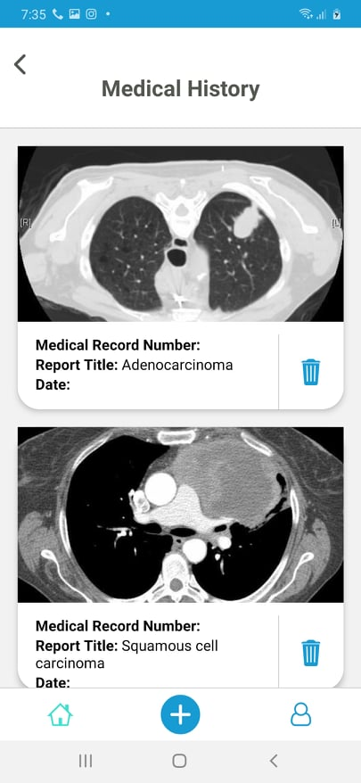

# LunX
Our graduation project.

# Getting Started

The proposed project (LunX) main idea is to construct and develop a personal doctor for Lung Cancer patients who can diagnoses and detects the presence of cancer from the patient’s CT Scan using a deep convolutional neural network. As well as providing support every second of every day, to help the patient through every step of his/her cancer experience. The app is designed to be easy to use by the patients, providing them very helpful features such as creating a profile for each patient for storing their medical history and information about their case. The application will include a community for lung cancer with doctors from all over the world to help spreading awareness about cancer and answering questions asked by patients. The community will include other patients to share their journey with cancer. 

### How to use

**Sign In & Sign Up Screens**

 the Login page where the user can access the app by entering both email and password combination. 
 If the user doesn’t have an account yet he can sign up for an account by entering some information like (Email, password and other information). 

___

**Community Screen**

is the page where you can write a post and share
experiences, knowledge with others and communicate with
patients like you to come up with a solution and you can also give
your impression to other patient’s by interacting with them using
several ways such as (comment, Like and adding there posts as a
favorite so you can access the post quickly).

___

**Detection Screen**

Is the most important page where the user can upload or take a
photo of his Chest CT-Scan image by clicking on the ‘Select
image’ button and choose if he want to upload or take a photo
using mobile camera then after this step to get the diagnose
prediction click on the diagnose button where the diagnose of the
image is returned and more information about the diagnose for
the user to see and understand more about the type of cancer
which was classified.

___

**Medical History**

Medical history page contains all the patient diagnoses data it is
like a medical report to easy understand the patient's condition.

## Built with

* "react-native": "0.61.5"
* "react-redux": "^7.2.0",
* "redux-thunk": "^2.3.0"
* "axios": "^0.19.2"
* "firebase": "^7.8.1", **For SignUp and SignIn only.**
* **MongoDB** for medical history, detection and community
* "react-native-image-picker": "^2.3.0"
